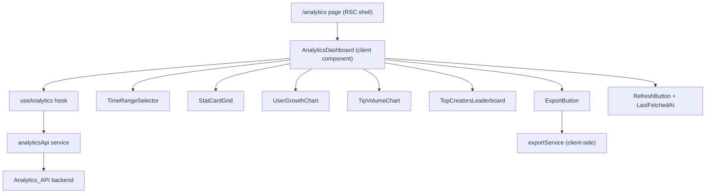

# Design Document: Analytics Dashboard

## Overview

The Analytics Dashboard is a new page at `/analytics` that surfaces platform-wide statistics for the Stellar Tip Jar platform. It provides stakeholders with interactive charts, summary stat cards, a top-creators leaderboard, and a report export capability — all scoped to a user-selected time range.

The feature is built entirely on the existing Next.js 14 (App Router) frontend. Data is fetched from the `Analytics_API` backend endpoint. The UI follows the existing design system (Tailwind tokens: `canvas`, `ink`, `wave`, `sunrise`, `moss`; `shadow-card`; `rounded-2xl` surfaces).

No new backend is introduced in this spec. The frontend consumes a single analytics endpoint and delegates all aggregation to the server.

---

## Architecture



The page shell (`/analytics/page.tsx`) is a React Server Component that renders the `<AnalyticsDashboard>` client component. All interactivity (time range selection, chart hover, export, refresh) lives inside the client component tree.

Data flow:
1. `AnalyticsDashboard` mounts → calls `useAnalytics(timeRange)`.
2. `useAnalytics` calls `analyticsApi.getMetrics(timeRange)` via the existing `request()` helper in `src/services/api.ts`.
3. On success, state is distributed to child components via props.
4. On error, an inline error banner is shown; previously loaded data remains visible.
5. Time range changes trigger a new fetch; the UI shows a loading overlay and disables the selector.

---

## Components and Interfaces

### `AnalyticsDashboard` (client component)
Central orchestrator. Owns `timeRange` state, delegates to `useAnalytics`, and passes data down.

```ts
interface AnalyticsDashboardProps {} // no external props; self-contained
```

### `TimeRangeSelector`
Renders four buttons (7d / 30d / 90d / 1y). Disabled while loading.

```ts
interface TimeRangeSelectorProps {
  value: TimeRange;
  onChange: (range: TimeRange) => void;
  disabled: boolean;
}
```

### `StatCard`
Displays a single metric value and its period-over-period trend badge.

```ts
interface StatCardProps {
  label: string;
  value: string | number;
  trend?: number;       // percentage, positive = up, negative = down
  loading: boolean;
}
```

### `UserGrowthChart`
Line chart (Recharts `LineChart`) of cumulative creator registrations.

```ts
interface UserGrowthChartProps {
  data: GrowthDataPoint[];
  loading: boolean;
  empty: boolean;
}
```

### `TipVolumeChart`
Bar chart (Recharts `BarChart`) of XLM tip volume per interval.

```ts
interface TipVolumeChartProps {
  data: VolumeDataPoint[];
  trend: number;        // period-over-period % change
  loading: boolean;
  empty: boolean;
}
```

### `TopCreatorsLeaderboard`
Ranked list of top 10 creators. Each row is a `<Link>` to `/creator/[username]`.

```ts
interface TopCreatorsLeaderboardProps {
  creators: TopCreator[];
  loading: boolean;
}
```

### `ExportButton`
Dropdown to choose CSV or JSON, then triggers `exportService.download()`.

```ts
interface ExportButtonProps {
  metrics: AnalyticsMetrics | null;
  timeRange: TimeRange;
  disabled: boolean;    // true while loading
}
```

### `RefreshButton`
Icon button that calls `refetch()` from `useAnalytics`. Shows spinner while refreshing.

```ts
interface RefreshButtonProps {
  onRefresh: () => void;
  loading: boolean;
  lastFetchedAt: Date | null;
}
```

### `analyticsApi` service (`src/services/analyticsApi.ts`)
Thin wrapper around the shared `request()` helper.

```ts
function getMetrics(timeRange: TimeRange): Promise<AnalyticsMetrics>
```

### `exportService` (`src/utils/exportService.ts`)
Pure client-side module; no network calls.

```ts
function download(metrics: AnalyticsMetrics, timeRange: TimeRange, format: ExportFormat): void
```

### `useAnalytics` hook (`src/hooks/useAnalytics.ts`)

```ts
function useAnalytics(timeRange: TimeRange): {
  metrics: AnalyticsMetrics | null;
  loading: boolean;
  error: Error | null;
  lastFetchedAt: Date | null;
  refetch: () => void;
}
```

---

## Data Models

```ts
// Supported time range values
type TimeRange = "7d" | "30d" | "90d" | "1y";

// Export format options
type ExportFormat = "csv" | "json";

// A single data point in the growth or volume chart
interface GrowthDataPoint {
  label: string;        // e.g. "2024-01-15" (daily) or "2024-W03" (weekly)
  count: number;        // cumulative creator count
}

interface VolumeDataPoint {
  label: string;        // same interval labelling as GrowthDataPoint
  xlm: number;          // total XLM tipped in this interval
}

interface TopCreator {
  rank: number;
  username: string;
  tipCount: number;
  totalXlm: number;
}

interface StatsSummary {
  totalTipsCount: number;
  totalTipsXlm: number;
  totalCreators: number;
  activeCreators: number;          // within selected time range
}

// Full response shape from Analytics_API
interface AnalyticsMetrics {
  timeRange: TimeRange;
  fetchedAt: string;               // ISO 8601 timestamp
  summary: StatsSummary;
  growthData: GrowthDataPoint[];
  volumeData: VolumeDataPoint[];
  volumeTrend: number;             // period-over-period % for tip volume
  topCreators: TopCreator[];
}
```

**Charting library**: [Recharts](https://recharts.org/) — React-native, composable, well-maintained, and SSR-safe (renders nothing on server, hydrates on client). It will be added as a dependency.

**Interval logic** (shared between API response and chart rendering):
- `7d` and `30d` → daily data points
- `90d` and `1y` → weekly data points

The interval granularity is determined server-side and reflected in the `label` field of each data point. The frontend does not re-aggregate.

**File naming for exports**: `analytics-{timeRange}-{YYYY-MM-DD}.{format}` — e.g. `analytics-30d-2024-07-15.csv`.

