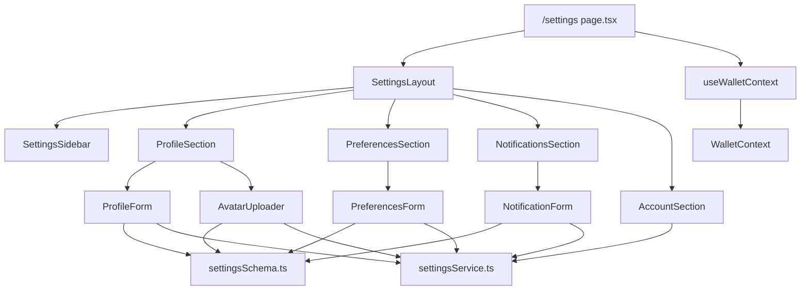

# Design Document: User Settings

## Overview

The User Settings feature adds a `/settings` page to Stellar Tip Jar where wallet-connected users can manage their creator profile, upload an avatar, configure display preferences, and control notification settings. All settings are persisted via the backend API.

The page is protected: unauthenticated visitors are redirected to `/`. The UI is organized into four named sections — Profile, Preferences, Notifications, and Account — navigable via a sticky sidebar (desktop) or tab strip (mobile).

The implementation follows the existing project conventions: Next.js App Router, `react-hook-form` + Zod for form management, Tailwind CSS with the existing design tokens, and the `api.ts` service pattern for HTTP calls.

---

## Architecture



The page component handles auth-gating. Each section is a self-contained component that owns its own form state, data fetching, and submission. The `settingsService.ts` module centralizes all HTTP calls. The `settingsSchema.ts` module defines all Zod schemas.

---

## Components and Interfaces

### Page: `src/app/settings/page.tsx`

A `"use client"` page that reads `isConnected` and `isConnecting` from `useWalletContext`. Renders a loading spinner while connecting, redirects to `/` when not connected, and renders `SettingsLayout` when connected.

### `SettingsLayout`

Wraps the four section components. Renders a sticky sidebar on `md+` screens and a horizontal tab strip on mobile. Each nav item is an anchor link (`#profile`, `#preferences`, `#notifications`, `#account`) for scroll-based navigation.

### `ProfileForm`

`react-hook-form` form backed by `profileSchema`. On mount, calls `settingsService.getProfile()` to pre-populate fields. On submit, calls `settingsService.updateProfile()`. Displays inline field errors, a success banner on save, and an error banner on failure (without clearing fields).

### `AvatarUploader`

Controlled file input. On file selection, validates type and size via `avatarFileSchema` and renders a preview using `URL.createObjectURL`. On confirm, calls `settingsService.uploadAvatar()` with a `FormData` payload. Shows an upload progress indicator (indeterminate spinner) and disables the button during upload. On success, replaces the preview with the returned URL.

### `PreferencesForm`

`react-hook-form` form backed by `preferencesSchema`. On mount, calls `settingsService.getPreferences()`. On submit, calls `settingsService.updatePreferences()`. On successful theme save, applies the theme by setting a `data-theme` attribute on `<html>` and persisting to `localStorage`.

### `NotificationForm`

`react-hook-form` form backed by `notificationsSchema`. On mount, calls `settingsService.getNotifications()`. On submit, calls `settingsService.updateNotifications()`. On failure, reverts toggle state to the last successfully saved snapshot.

### `AccountSection`

Displays the public key in a read-only `<input>`. Provides "Disconnect Wallet" (calls `disconnect()` from context, then `router.push('/')`) and "Delete Account" (shows a `<dialog>`-based confirmation modal; on confirm calls `settingsService.deleteAccount()`).

### `SettingsSidebar` / `SettingsTabs`

Navigation components. `SettingsSidebar` renders a vertical `<nav>` with anchor links, visible on `md+`. `SettingsTabs` renders a horizontal scrollable tab strip, visible on mobile.

### Navbar update

`Navbar.tsx` gains a conditional Settings link rendered only when `isConnected` is true. Since `Navbar` is currently a server component, it will need to become `"use client"` to read wallet state, or a new `NavSettingsLink` client component can be extracted to keep the server boundary.

---

## Data Models

### Zod Schemas (`src/schemas/settingsSchema.ts`)

```typescript
import { z } from "zod";

export const profileSchema = z.object({
  displayName: z.string().trim().min(1, "Display name is required.").max(50, "Max 50 characters."),
  username: z
    .string()
    .trim()
    .min(1, "Username is required.")
    .max(30, "Max 30 characters.")
    .regex(/^[a-zA-Z0-9-]+$/, "Only letters, numbers, and hyphens allowed."),
  bio: z.string().trim().max(300, "Max 300 characters.").optional().or(z.literal("")),
  preferredAsset: z
    .string()
    .trim()
    .min(1, "Asset code is required.")
    .max(12, "Max 12 characters.")
    .regex(/^[A-Za-z0-9]+$/, "Only letters and numbers allowed.")
    .transform((v) => v.toUpperCase()),
});

export const avatarFileSchema = z.object({
  type: z.enum(["image/jpeg", "image/png", "image/webp"], {
    errorMap: () => ({ message: "Only JPEG, PNG, or WebP files are accepted." }),
  }),
  size: z.number().max(2 * 1024 * 1024, "File must be 2 MB or smaller."),
});

export const preferencesSchema = z.object({
  theme: z.enum(["light", "dark", "system"]),
  currency: z.enum(["XLM", "USD", "EUR"]),
});

export const notificationsSchema = z.object({
  newTip: z.boolean(),
  milestone: z.boolean(),
  weeklySummary: z.boolean(),
  emailChannel: z.boolean(),
  inAppChannel: z.boolean(),
});

export type ProfileValues = z.output<typeof profileSchema>;
export type AvatarFileInput = z.input<typeof avatarFileSchema>;
export type PreferencesValues = z.output<typeof preferencesSchema>;
export type NotificationsValues = z.output<typeof notificationsSchema>;
```

### API Service (`src/services/settingsService.ts`)

```typescript
// All methods delegate to the shared `request` helper in api.ts

getProfile(): Promise<ProfileValues>
updateProfile(data: ProfileValues): Promise<void>          // PATCH /users/profile
uploadAvatar(file: File): Promise<{ avatarUrl: string }>   // POST  /users/avatar (multipart)
getPreferences(): Promise<PreferencesValues>
updatePreferences(data: PreferencesValues): Promise<void>  // PATCH /users/preferences
getNotifications(): Promise<NotificationsValues>
updateNotifications(data: NotificationsValues): Promise<void> // PATCH /users/notifications
deleteAccount(): Promise<void>                             // DELETE /users/account
```

A `409 Conflict` response from `updateProfile` is surfaced as a typed `UsernameConflictError` so `ProfileForm` can set a field-level error without a generic error banner.

### Theme Application

Theme is stored as a `data-theme` attribute on `<html>`. A small utility `applyTheme(theme: 'light' | 'dark' | 'system')` reads `prefers-color-scheme` when `system` is selected and sets the attribute. This is called immediately on preferences save and on initial page load (reading from `localStorage`).

---

## Correctness Properties

*A property is a characteristic or behavior that should hold true across all valid executions of a system — essentially, a formal statement about what the system should do. Properties serve as the bridge between human-readable specifications and machine-verifiable correctness guarantees.*

### Property 1: Unauthenticated redirect

*For any* render of the Settings page where `isConnected` is `false` and `isConnecting` is `false`, the component should redirect to `/` and not render any settings content.

**Validates: Requirements 1.1**

---

### Property 2: Profile field validation

*For any* combination of display name, username, bio, and preferred asset values, the `profileSchema` should accept the input if and only if each field satisfies its documented constraints (length limits and character restrictions).

**Validates: Requirements 2.1, 7.1, 7.2**

---

### Property 3: Form pre-population round-trip

*For any* settings data object returned by the API (profile, preferences, or notifications), rendering the corresponding form should result in each field displaying the value from that data object.

**Validates: Requirements 2.3, 4.4, 5.4**

---

### Property 4: Avatar file validation

*For any* file input, the `avatarFileSchema` should accept the file if and only if its MIME type is one of `image/jpeg`, `image/png`, or `image/webp` AND its size is at most 2 MB; all other files should be rejected with a validation error and no upload request should be initiated.

**Validates: Requirements 3.1, 3.4, 7.4**

---

### Property 5: Avatar URL display after upload

*For any* successful avatar upload response containing an `avatarUrl`, the displayed avatar image `src` should equal the `avatarUrl` returned by the API.

**Validates: Requirements 3.6**

---

### Property 6: Inline validation error lifecycle

*For any* settings form field, submitting an invalid value should produce an inline error message for that field; subsequently correcting the field to a valid value and re-validating should clear that error.

**Validates: Requirements 7.2, 7.3**

---

### Property 7: Settings link visibility matches wallet state

*For any* wallet connection state, the Settings link in the Navbar should be visible if and only if `isConnected` is `true`.

**Validates: Requirements 8.3**

---

## Error Handling

| Scenario | Behavior |
|---|---|
| Network error on any settings save | Display a descriptive error banner; retain current form values |
| `409 Conflict` on profile save | Set field-level error on the `username` field: "Username already taken" |
| Invalid file selected for avatar | Show inline validation error; do not call the upload API |
| Avatar upload failure | Show error banner; re-enable upload button |
| Preferences save failure | Show error banner; revert displayed values to last saved snapshot |
| Notifications save failure | Show error banner; revert toggles to last saved snapshot |
| Account deletion failure | Show error banner; do not disconnect wallet or redirect |
| Settings page accessed without wallet | Redirect to `/` |
| API returns unexpected shape | Log via `errorLogger`; show generic "Something went wrong" message |

All API calls in `settingsService.ts` wrap errors and re-throw typed errors where the UI needs to distinguish them (e.g., `UsernameConflictError`). Generic errors fall through to a catch block in each form component.

---

## Testing Strategy

### Unit Tests

Focus on specific examples, edge cases, and integration points:

- Settings page renders loading spinner when `isConnecting=true`
- Settings page renders settings UI when `isConnected=true`
- Settings page redirects when `isConnected=false` and `isConnecting=false`
- `ProfileForm` pre-populates fields from fetched data
- `ProfileForm` shows success banner on successful save
- `ProfileForm` shows error banner without clearing fields on API failure
- `ProfileForm` shows field-level "Username already taken" on 409 response
- `AvatarUploader` shows preview after valid file selection
- `AvatarUploader` disables upload button and shows spinner during upload
- `AvatarUploader` updates displayed image to returned URL on success
- `PreferencesForm` renders all three theme options and all three currency options
- `NotificationForm` renders all five toggle controls
- `NotificationForm` reverts toggles to last saved state on save failure
- `AccountSection` displays public key in a read-only field
- `AccountSection` shows confirmation dialog before account deletion
- `AccountSection` does not disconnect or redirect on deletion failure
- `SettingsSidebar` renders links for all four sections
- Navbar shows Settings link when connected, hides it when disconnected

### Property-Based Tests

Use [fast-check](https://github.com/dubzzz/fast-check) for property-based testing. Each test should run a minimum of 100 iterations.

**Property 1: Unauthenticated redirect**
```
// Feature: user-settings, Property 1: Unauthenticated redirect
fc.assert(fc.property(
  fc.record({ isConnected: fc.constant(false), isConnecting: fc.constant(false) }),
  (walletState) => {
    // render SettingsPage with walletState, assert redirect to "/" is triggered
  }
), { numRuns: 100 });
```

**Property 2: Profile field validation**
```
// Feature: user-settings, Property 2: Profile field validation
fc.assert(fc.property(
  fc.record({
    displayName: fc.string(),
    username: fc.string(),
    bio: fc.string(),
    preferredAsset: fc.string(),
  }),
  (input) => {
    const result = profileSchema.safeParse(input);
    const valid =
      input.displayName.trim().length >= 1 &&
      input.displayName.trim().length <= 50 &&
      input.username.trim().length >= 1 &&
      input.username.trim().length <= 30 &&
      /^[a-zA-Z0-9-]+$/.test(input.username.trim()) &&
      input.bio.trim().length <= 300 &&
      input.preferredAsset.trim().length >= 1 &&
      input.preferredAsset.trim().length <= 12 &&
      /^[A-Za-z0-9]+$/.test(input.preferredAsset.trim());
    return result.success === valid;
  }
), { numRuns: 100 });
```

**Property 3: Form pre-population round-trip**
```
// Feature: user-settings, Property 3: Form pre-population round-trip
fc.assert(fc.property(
  fc.record({
    displayName: fc.string({ minLength: 1, maxLength: 50 }),
    username: fc.stringMatching(/^[a-zA-Z0-9-]{1,30}$/),
    bio: fc.string({ maxLength: 300 }),
    preferredAsset: fc.stringMatching(/^[A-Za-z0-9]{1,12}$/),
  }),
  (profileData) => {
    // render ProfileForm with mocked getProfile returning profileData
    // assert each form field value equals the corresponding profileData field
  }
), { numRuns: 100 });
```

**Property 4: Avatar file validation**
```
// Feature: user-settings, Property 4: Avatar file validation
fc.assert(fc.property(
  fc.record({
    type: fc.string(),
    size: fc.nat(5 * 1024 * 1024),
  }),
  ({ type, size }) => {
    const result = avatarFileSchema.safeParse({ type, size });
    const valid =
      ["image/jpeg", "image/png", "image/webp"].includes(type) &&
      size <= 2 * 1024 * 1024;
    return result.success === valid;
  }
), { numRuns: 100 });
```

**Property 5: Avatar URL display after upload**
```
// Feature: user-settings, Property 5: Avatar URL display after upload
fc.assert(fc.property(
  fc.webUrl(),
  (avatarUrl) => {
    // mock uploadAvatar to resolve with { avatarUrl }
    // simulate upload confirmation
    // assert displayed  src equals avatarUrl
  }
), { numRuns: 100 });
```

**Property 6: Inline validation error lifecycle**
```
// Feature: user-settings, Property 6: Inline validation error lifecycle
fc.assert(fc.property(
  fc.constantFrom("displayName", "username", "bio", "preferredAsset"),
  fc.string(),
  (fieldName, invalidValue) => {
    // submit form with invalid value for fieldName
    // assert inline error is shown for fieldName
    // correct the field to a valid value
    // re-validate
    // assert inline error for fieldName is cleared
  }
), { numRuns: 100 });
```

**Property 7: Settings link visibility matches wallet state**
```
// Feature: user-settings, Property 7: Settings link visibility matches wallet state
fc.assert(fc.property(
  fc.boolean(),
  (isConnected) => {
    // render Navbar with isConnected
    // assert settings link presence === isConnected
  }
), { numRuns: 100 });
```
